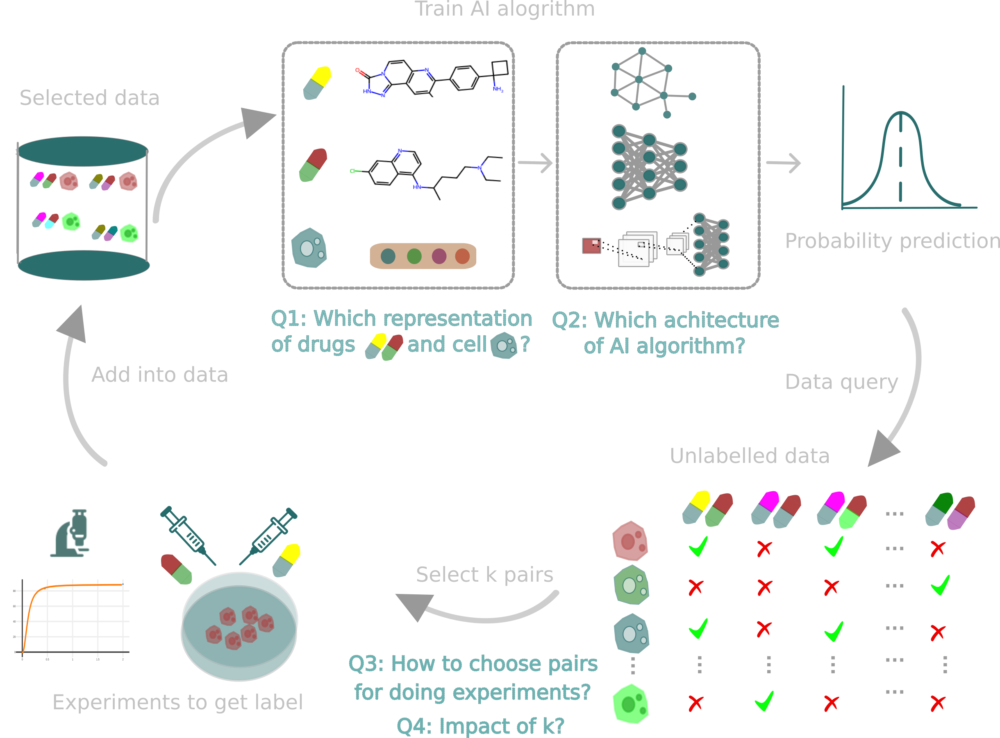

# A Guide for Active Learning in Synergistic Drug Discovery

This is the official codebase for **A Guide for Active Learning in Synergistic Drug Discovery**.
 

# Environment Install 

```bash 
conda env create -f environment.yml 
```

When the environment was installed, you could just

```bash 
conda activate drugsynergy 
```

Or you can install you simple environments by:
```
conda create -n drugsynergy python
conda install pytorch==2.3.1 torchvision==0.18.1 torchaudio==2.3.1 pytorch-cuda=12.1 -c pytorch -c nvidia
pip install scikit-learn  matplotlib scikit-learn matplotlib pyarrow tqdm pandas
```
Now you can have fun with the code:

# Data

[DrugComb data](https://drugcomb.org/download/)

Then use preprocess/F1_get_data.py to extract Oneil and Almanac data 

## Training

The following command will train MLP model and use different strategies in active learning to optimize the candidate selection:
```bash
python main.py --num_drugs 50 --num_step_limit 10 --flag_acquisition 'exploitation'

python main.py --num_drugs 50 --num_step_limit 10 --flag_acquisition 'exploration'

python main.py --num_drugs 50 --num_step_limit 10 --flag_acquisition 'random'

python main.py --num_drugs 50 --num_step_limit 10 --flag_acquisition 'hybrid' 
```

## Benchmark on different drug & cell features & permutation operation
```bash
python mlp_model_benchmark.py --frac 0.1 --drug_feature morgan --cell_feature ge --operation additive

python mlp_model_benchmark.py --frac 0.1 --drug_feature maccs --cell_feature onehot --operation max

python mlp_model_benchmark.py --frac 0.1 --drug_feature onehot --cell_feature ge --operation bilinear

```

## Data efficiency test 
The fraction can be self-defined. 
```bash
python mlp_model_benchmark.py --frac 0.1 --drug_feature morgan --cell_feature ge --operation additive

python mlp_model_benchmark.py --frac 0.8 --drug_feature morgan --cell_feature ge --operation additive
```

## Generalization benchmark 
```bash
cd generalization

# leave-cell-out
python test.py --flag cell 

# leave-one-drug-out
python test.py --flag one_drug

# leave-two-drug-out
python test.py --flag two_drug

# leave-combination-out
python test.py --flag comb

# leave-tissue-out
python test.py --flag tissue 
```

## Possible problems & Solution
If you have several GPU, you can choose GPU by adding device command, such as:
```bash
python mlp_model_benchmark.py --frac 0.1 --drug_feature morgan --cell_feature ge --operation additive --device 'cuda:0'
python mlp_model_benchmark.py --frac 0.1 --drug_feature morgan --cell_feature ge --operation additive --device 'cuda:1'
```
If you don't have GPU or your GPU memory is not enough for the training, you can use CPU by adding device in the command such as:
```bash
python main.py --num_drugs 50 --num_step_limit 10 --flag_acquisition 'exploitation' --device 'cpu'

python mlp_model_benchmark.py --frac 0.1 --drug_feature morgan --cell_feature ge --operation additive --device 'cpu'

python test.py --flag tissue --device 'cpu'

```
