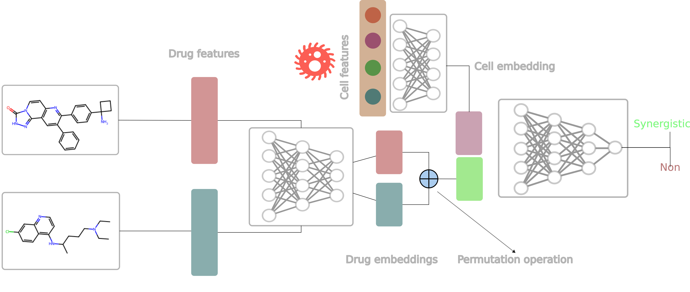

# A Guide for Active Learning in Synergistic Drug Discovery

This is the official codebase for **A Guide for Active Learning in Synergistic Drug Discovery**.
 

# Data

[DrugComb data](https://drugcomb.org/download/)

Then use preprocess/F1_get_data.py to extract Oneil and Almanac data 
